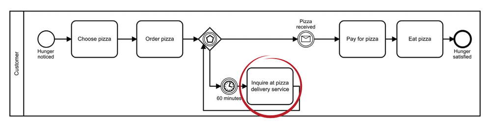

## Background

This process is almost complete. It does not consider one step that have to be added.

### Task: Model the following situation.

If the customer receives the pizza during the inquiry, he ends the telephone conversation and pays for the pizza.

