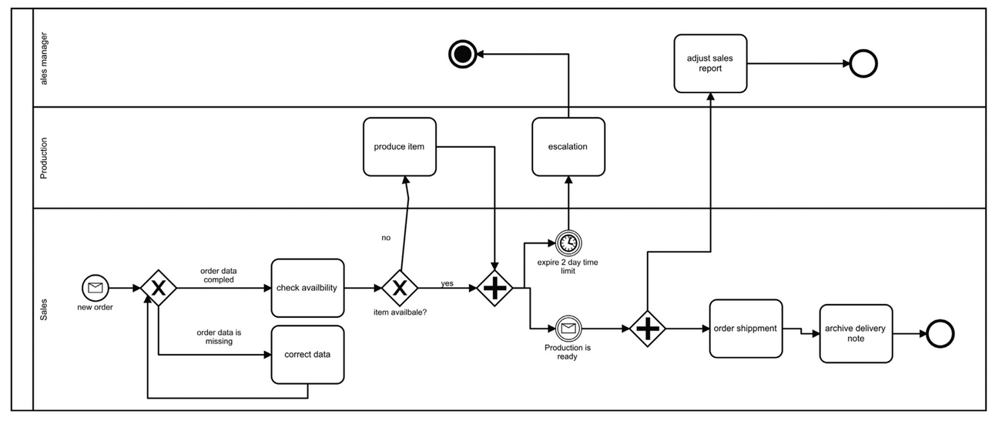

## Background

The following model contains errors, modeling, wording, etc.

### Task: Find the errors in the model and then improve the model.

In the first step, you have to detect mistakes and try to still interpret the intended meaning in the right way. In the next step, you should improve the process model, which should also follow modeling best practices.

