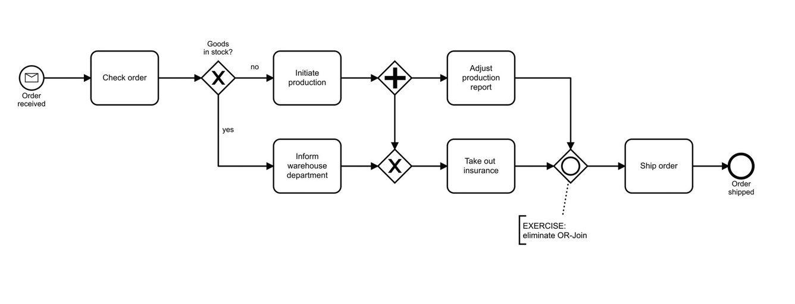

## Background

This process works fine, but requires adjusment. The goal is to practice modelling an alternative construction that does the same as the original.

### Task: Eliminate the OR-join from the following process model.

