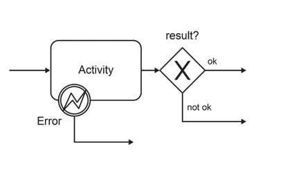

## Background

This process considers only the standard way but not yet all possible problems that can happen.

### Task: Add the handling of the following problems to the same model that shows the happy path.

1. The order data is incomplete
2. The order data is unreadable
3. The customer number within the order is wrong
4. The credit rating of the customer is insufficient
5. The ordered item is not available
6. Sending the order confirmation fails.

**Hints**

For each problem use either an error event attached to the activity or a XOR-gateway after the activity.

* Except for problem 6, all of the above situations lead to the rejection of the order.
* Use the same model for the whole assignment.
* You do not have to model error throw events. Suppose the errors were created within the activities. You only need to model error
handlers where applicable.

