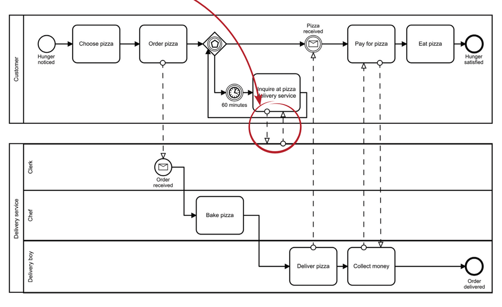
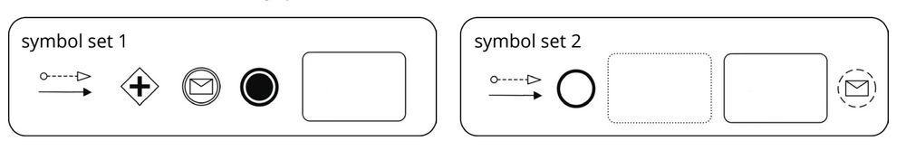

## Background

If the customer calls because of the delayed pizza, the clerk should calm him down.

### Task: Model the following situation.

Use one of the following symbol set.

**Hints**

* For the solution, it is sufficient if the pool of the customer is collapsed.

* Each subtask (symbol set 1 or symbol set 2) should be worked out in a separate BPMN model.